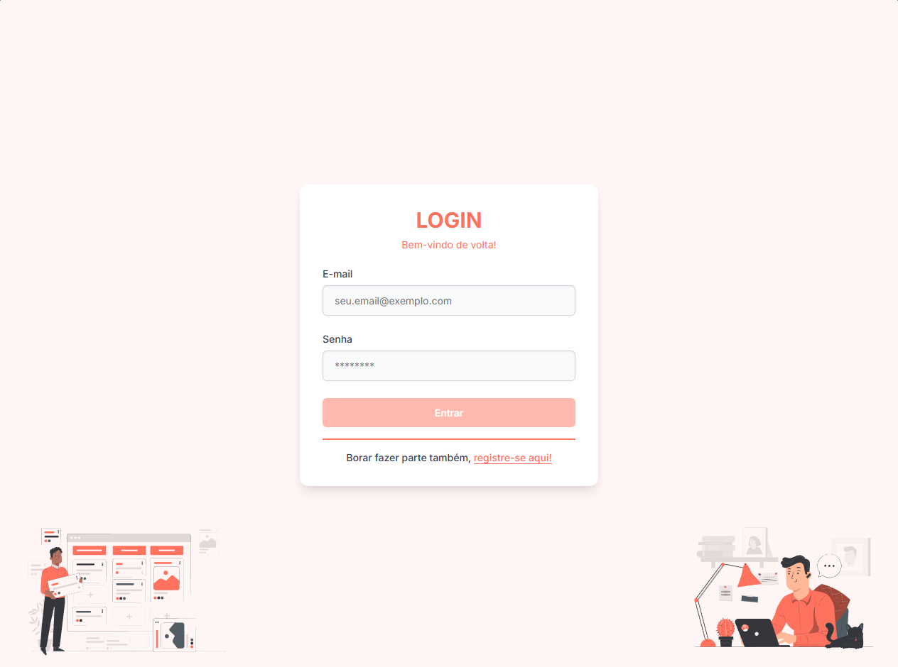
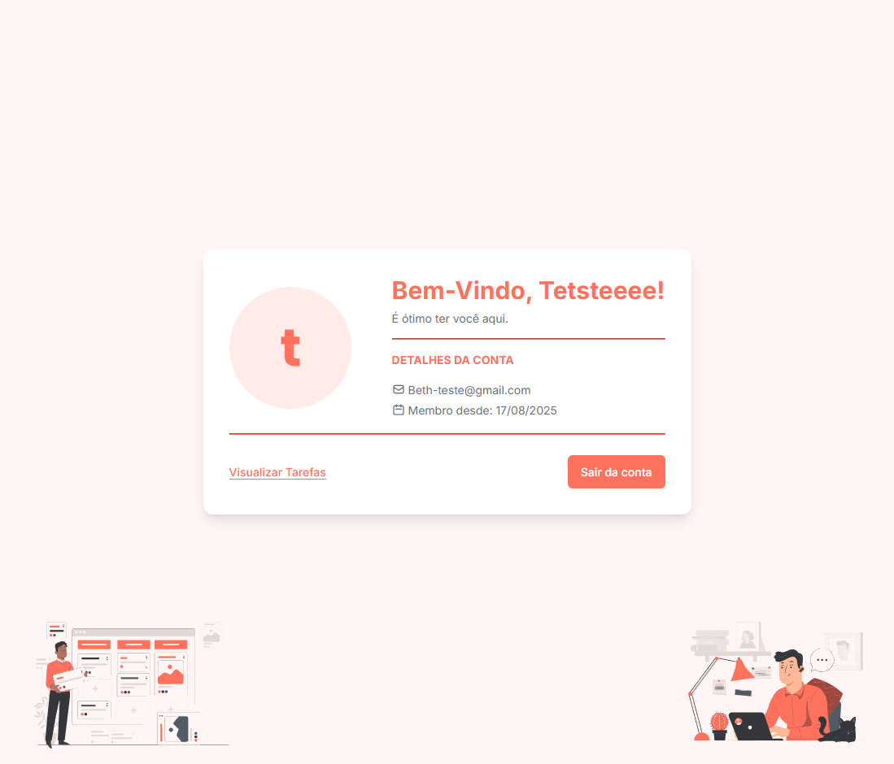
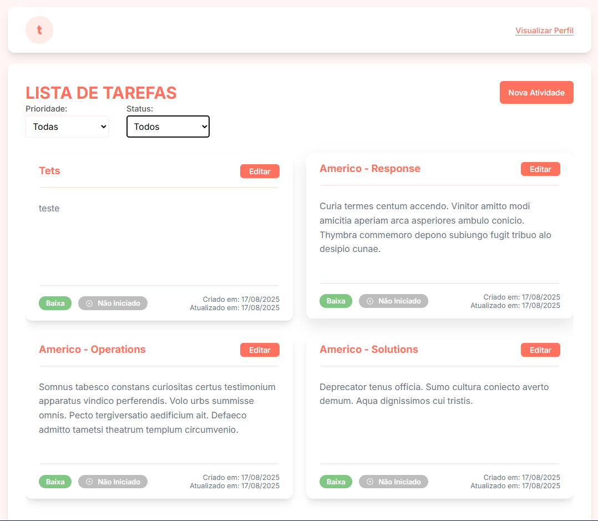
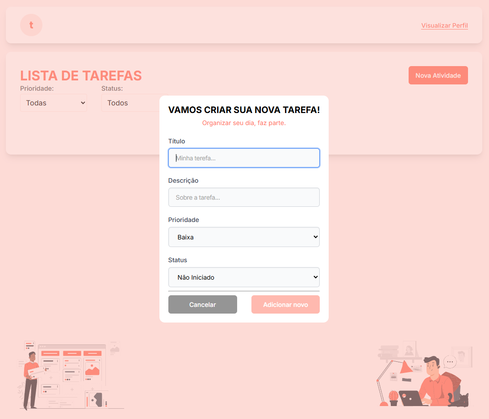

# Task Manager FrontEnd

O Task Manager é uma aplicação desenvolvida com Angular, projetada para ajudar usuários a gerenciar suas tarefas diárias. Com uma interface limpa e reativa, o projeto permite a criação, organização, atualização de tarefas, facilitando o acompanhamento de pendências e o aumento da produtividade. Esta aplicação foi construída como uma vitrine para demonstrar o uso de conceitos avançados do Angular, focando em performance, manutenibilidade e uma excelente experiência de usuário.

## Minha considerações  

Devido ao tempo disponível, não consegui implementar um ambiente completo em Docker para o deploy. Ainda assim, considero que o projeto foi uma ótima oportunidade de aprendizado e experimentação.

Um dos pontos que mais gostei de explorar foi a gerência de estado com BehaviorSubject, algo que eu queria testar há algum tempo e que se encaixou muito bem nesse contexto. Outro aspecto relevante foi a autenticação JWT: normalmente, vemos implementações que apenas verificam se o token existe no localStorage, sem validar sua integridade. Esse comportamento pode ser explorado facilmente caso alguém insira manualmente um valor qualquer na chave do token.

Para tratar esse cenário, implementei um evento que monitora alterações no localStorage. Se o token for modificado manualmente, a aplicação dispara uma chamada a uma rota protegida para verificar sua validade, garantindo assim maior segurança está incompleto merece um ajuste.

Além disso, consegui implementar paginação e filtros na listagem de tarefas e utilizei o Angular CDK para criar um modal. Meu objetivo inicial era aplicar o recurso de drag and drop para organizar tarefas em estilo kanban, mas, pela simplicidade e pelo tempo disponível, deixei essa funcionalidade para uma evolução futura.

No geral, o projeto foi uma boa experiência prática, permitindo consolidar conceitos que eu vinha estudando e colocando em prática recursos que agregam valor tanto em termos de arquitetura quanto de usabilidade.

## Recursos Angular e Conceitos de Desenvolvimento

Além de funcionalidades visíveis, o projeto utiliza recursos e conceitos importantes do ecossistema Angular e boas práticas de desenvolvimento:

- **Gerência de estado local com BehaviorSubject**  
  Usado em serviços para compartilhar dados entre componentes e monitorar o estado do usuário/tarefas sem a necessidade de bibliotecas externas (NgRx, Akita, etc.).

- **Angular CDK (Component Dev Kit)**  
  Utilizado para criar modais customizados e componentes acessíveis. Há plano de uso para drag-and-drop (board estilo kanban).  

- **Componentização e reutilização**  
  Criação de componentes reaproveitáveis e desacoplados (`task-card`, `pagination`, `password-strength`, etc.), seguindo boas práticas de **Single Responsibility**.  

- **Injeção de Dependência (Dependency Injection)**  
  Utilizada em services (`AuthService`, `UsersService`, `TaskService`) para desacoplar a lógica de negócio da camada de apresentação.  

- **Reactive Forms**  
  Uso de `FormGroup`, `FormControl` e validações reativas para formulários de login, registro e tarefas.  

- **Interceptors e Guards**  
  O `AuthInterceptor` adiciona automaticamente o token JWT nas requisições e o `AuthGuard` garante que apenas usuários autenticados acessem rotas protegidas.  

- **Boas práticas de arquitetura Angular**  
  - Organização modularizada (`features/users`, `features/task`).  
  - Separação clara entre páginas, componentes e serviços.  
  - Uso de ambientes (`environment.ts` / `environment.prod.ts`).  
  - Estrutura escalável, já preparada para novas features.  


## Funcionalidades

Abaixo estão as funcionalidades planejadas e o status atual de implementação de cada uma delas:


- [x] Autenticação de Usuários: Sistema completo de login e cadastro para garantir a privacidade e segurança das tarefas.

- [] Editar informações de usuario.
- [] Deletar conta do usuario.
- [] Alterção de senha do conta do usuario.

- [x] Criação e Gestão de Tarefas (CRUD):

  - [x] Adicionar novas tarefas com título, descrição e prioridade e status.

  - [x] Visualizar todas as tarefas em um layout de lista.

  - [x] Editar os detalhes de uma tarefa existente.

  - [] Excluir tarefas.

- [x] Paginação baseada da listar.

- [x] Filtros e Ordenação: Filtrar tarefas por status (pendente, em andamento, concluída) ou prioridade.

- [] Busca por titulo da tafefa: Encontrar tarefas específicas instantaneamente através de uma barra de pesquisa reativa.

- [x] Design Responsivo: A aplicação se adapta perfeitamente a diferentes tamanhos de tela (desktops, tablets e smartphones).
- [] Toash de para mostrar feedeback para usuario quando uma operação concluido exemplo de secesso, error e edição.
- [] Nova visualização no formato Drag-and-drop de tarefas para quadro kanba usando angular cdk.

## Funcionalidades com problemas encontrados

- [] Ajusta a validação de token, para caso quando ocorrer o refresh da pagina ainda permanece logado.
- [] No formulario de criação de tarefas contêm apenas validação de campos obrigatórios, adicionar tamenho minimo para campos de titulo e descrição.
- [] A listagem quando não contêm nenhum item em alguns momentos não atualiza quando inserido uma nova tarefas.
- [] A filtro não resetar em alguns momentos para todas. 

## Tecnologias utilizadas

- **Framework:** Angular v17  
- **Linguagem:** TypeScript  
- **Estilos:** CSS  
- **Angular CDK:** modais e utilitários  
- **JWT:** autenticação baseada em tokens  
- **Gerenciamento de estado leve:** BehaviorSubject  

# Demo / Deploy

Acesse a versão hospedada:  
🔗 **[Task Manager Frontend - Deploy Vercel](https://task-manager-front-end-dun.vercel.app/)**  


## Pré-requisitos

- Node.js (>= 18.x)  
- npm (>= 9.x)  
- Git  
- Backend da API (esperado na porta `3333`).  

<h1 align="center">
    <strong> Projeto</strong>
</h1>

<p align="center">
    <apan align="center">
      
    </apan>
</p>

<p align="center">
    <apan align="center">
      
    </apan>
</p>

<p align="center">
    <apan align="center">
      
    </apan>
</p>

<p align="center">
    <apan align="center">
      
    </apan>
</p>


## Clone este repositório usando o comando:

```bash
git clone https://github.com/erikbernard/task-manager-front-end
```
Acesse a pasta `task-manager`:
```bash
cd task-manager-front-end
```
npm run install
```
npm run start
```

## Usando o docker

Para iniciar o ambiente Docker, execute o seguinte comando:
   ```bash
    docker-compose up -d

    # ou no docker engine

    docker compose up -d
   ```
   Isso iniciará os contêineres Docker necessários.

E acesse a pagina `http://localhost:4200/`. Certifique que o backend(usando docker ou local) estaja rodando na porta 3333

